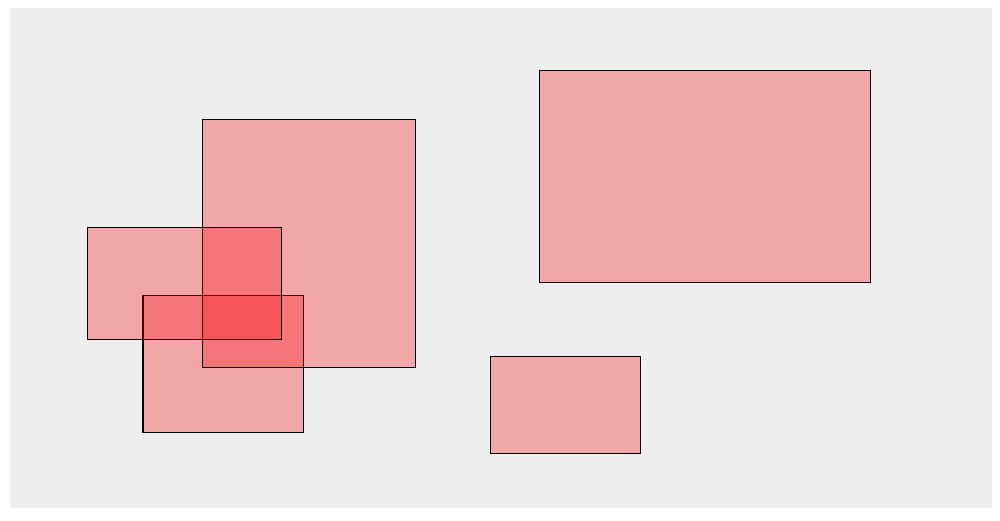

# `d3-brush` Multiple Brushes

This is an implementation of *multiple brushes in D3js version 4*.
While brushes give a good out-of-the-box behavior for single brushes, it is not immediately clear how to implement multiple selections/brushes. This is far from a good solution, but it gets you started in understanding what's necessary.

## About
Created 2016-10-30 by Ludwig Schubert for Stanford's Fall 2016 offering of CS 448b—Data Visualization.
