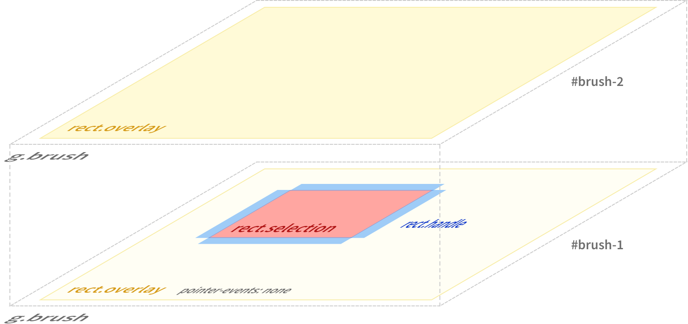

# `d3-brush` Multiple Brushes


This is an implementation of *multiple brushes in D3js version 4*.
While brushes give a good out-of-the-box behavior for single brushes, it is not immediately clear how to implement multiple selections/brushes. This is far from a good solution, but it gets you started in understanding what's necessary.

## Explanatory piazza post to CS 448b students

Hey everyone;

as mentioned in class today some of your ran into [d3-brush](https://github.com/d3/d3-brush) while implementing your assignment 3 homework.
D3-brush is a library for movable, resizable "brushes" that allow selecting data. Sounds perfect for A3? Yes it does!

Unfortunately, brushes were not created with the idea of having multiple discontinous selections. So to use them in implementing the time searcher boxes behavior for A3, we will need to examine how `d3-brush` works behind the scenes. Once we understand their mechanics we can then tweak them to behave like we want them to.

**The workings of d3-brush**

The [d3-brush documentation](https://github.com/d3/d3-brush) explains the internal structure of a brush like this:

> The brush also creates the SVG elements necessary to display the brush selection and to receive input events for interaction. You can add, remove or modify these elements as desired to change the brush appearance; you can also apply stylesheets to modify the brush appearance. The structure of a two-dimensional brush is as follows:
> 
> ```
>  <g class="brush" fill="none" pointer-events="all" style="-webkit-tap-highlight-color: rgba(0, 0, 0, 0);">
>  <rect class="overlay" pointer-events="all" cursor="crosshair" x="0" y="0" width="960" height="500"></rect>
>  <rect class="selection" cursor="move" fill="#777" fill-opacity="0.3" stroke="#fff" shape-rendering="crispEdges" x="112" y="194" width="182" height="83"></rect>
>  <rect class="handle handle--n" cursor="ns-resize" x="107" y="189" width="192" height="10"></rect>
>  <rect class="handle handle--e" cursor="ew-resize" x="289" y="189" width="10" height="93"></rect>
>  <rect class="handle handle--s" cursor="ns-resize" x="107" y="272" width="192" height="10"></rect>
>  <rect class="handle handle--w" cursor="ew-resize" x="107" y="189" width="10" height="93"></rect>
>  <rect class="handle handle--nw" cursor="nwse-resize" x="107" y="189" width="10" height="10"></rect>
>  <rect class="handle handle--ne" cursor="nesw-resize" x="289" y="189" width="10" height="10"></rect>
>  <rect class="handle handle--se" cursor="nwse-resize" x="289" y="272" width="10" height="10"></rect>
>  <rect class="handle handle--sw" cursor="nesw-resize" x="107" y="272" width="10" height="10"></rect>
>  </g>
> ```
> 
> The overlay rect covers the brushable area defined by [_brush_.extent](https://github.com/d3/d3-brush#brush_extent). The selection rect covers the area defined by the current [brush selection](https://github.com/d3/d3-brush#brushSelection). The handle rects cover the edges and corners of the brush selection, allowing the corresponding value in the brush selection to be modified interactively.


Allright, that's a lot of svg elements for a simple brushing behavior. But look at them in turn, and every element makes sense:


*   `g.brush` — this is simply a group to keep all the elements together
*   `rect.overlay` — a transparent overlay that captures mouse events for creating the brush selection; this will be important for multiple brushes later on
*   `rect.selection` — a rectangle indicating the selected area, this will be what's actually visible on screen when you click and drag to filter
*   a bunch of `rect.handle` — these are invisible boxes to allow resizing on all edges and corners

So when we call `d3.brush()` on our `svg` element, we already create all of this—even though selection will be empty, and thus invisible (0 by 0 pixels), _the overlay already exists and captures mouse events._ Keep this in mind for part 2:

**Implementing multiple brushes**

So we've understood `d3.brush`, called it on our `svg` element; what do we see? At first everything seems good: clicking and dragging creates a rectangle on screen; we can move and resize it, and even programmatically query its dimensions and position to use in our filtering logic. The trouble only starts once we want to create a _second_ filter. [Clicking and dragging on the seemingly empty space next to our first brush does not create another brush; the first one seems to disappear.](http://bl.ocks.org/ludwigschubert/d02a0250bb45f724ba2594b561ca91d1)

You might have considered simply having an `onmousedown` handler on your `svg` element to create an extra brush; or maybe to simply call `d3.brush()` on your `svg` element again, but to your surprise your handler doesn't even get called anymore. Time to step back and think about the structure of the DOM elements our original call to `d3.brush` created.

I'm sure some of you have already noticed: the reason we're not getting events anymore and that the brush seems to disappear is that the original brush's overlay never stopped listening to mouse events. Consequently, the solution lies in:

*   Disabling mouse events  (`pointer events` in CSS parlance) on the brushes overlay layer once it has been created, and
*   Calling `d3.brush()` on the `svg` element again after we have created a brush and disabled its overlay layer's mouse events.

The latter will create a new overlay layer for the second brush, ready to capture mouse events to draw a second selection. Mouse events inside the selection rectangle of the original brush will still be handled by it, as we only disabled the mouse events on its overlay layer:



[See it with sourcecode here](http://bl.ocks.org/ludwigschubert/0236fa8594c4b02711b2606a8f95f605). Go ahead and read through the implementation; it's not overly long and it's commented.

That is the entire recipe, and I hope this writeup helped you understand what is going on. I believe there are some takeways here:

*   Abstractions are "leaky", _even if they're good abstractions_. You will always need to learn some parts of the underlying layers to understand how to effectively work with higher level tools.
*   D3 is supremely "hackable" thanks to it basically being SVG elements and JS event handlers. Was it "easy" to immediately see how to implement this? Not necessarily! But once I sat down and took a look at what D3 was doing, everything made sense and there was no wacky magic I had to work around.

When I wrote the original example solution for A3 I meant for you to implement resizing and dragging of filters yourselves. This was because I did not know about `d3-brush`, not because I wanted you to reimplement existing behavior—but I enjoyed how this turned into an exercise in exploring the inner workings of D3 libraries and hope it leaves you with a deeper understanding and appreciation of the design of D3.

As always, come to us with any questions you still have—D3 or otherwise—and now go forth and create a prototype for those final projects!

Ludwig

## About
Created 2016-10-30 by Ludwig Schubert for Stanford's Fall 2016 offering of CS 448b—Data Visualization.
